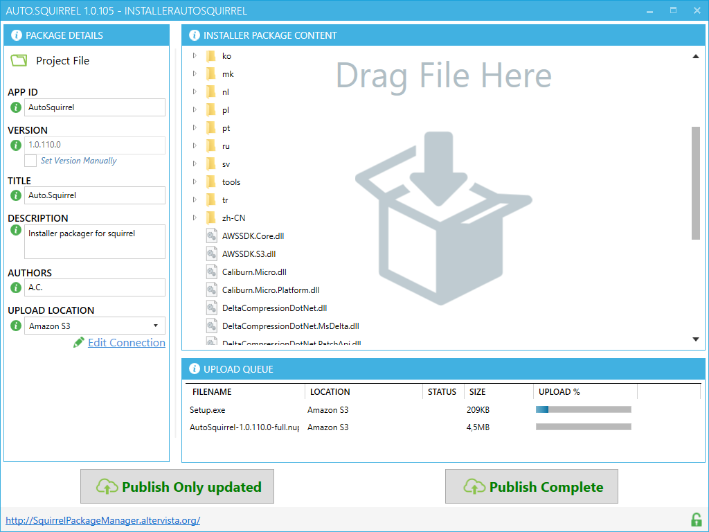

# **Squirrel Package Manager**

___

#### This utility is useful to create installer based on **[Squirrel.Windows](https://github.com/Squirrel/Squirrel.Windows)**.

The main purpose is to fully automatize the application deploy , from build to upload  the updated files.
____

### With a single mouse click you can :

1. **Update Application Version** the package version is extracted from exe file , you don't need to set this value manually

2. **Create Squirrel Package** . In similar way you do with Nuget Package Manager, just drag the file you want into window. No need to create lib/net45 folder.

3. **Upload installer files** . Set connection details one time .

4. **Decide to upload only the updated files or do complete setup upload**

____

 ## Read also :

* **[Project Version Auto-Increment](docs/VersionAutoIncrement.md)**

* **[Update Manager Integration](docs/SquirrelIntegration.md)**

* **[Squirrel Package Creation](docs/PackageCreation.md)**

## [DOWNLOAD](https://s3-eu-west-1.amazonaws.com/squirrelpackager/Setup.exe)
___

 
___

## TODOS

- [ ] Button to abort upload
- [ ] Renaming of output file and  folder
- [ ] Check if same filename is present in same directory
- [ ] Possibility to select the main EXE file ( where i extract the version number) , if two or more exe files are present in package.
