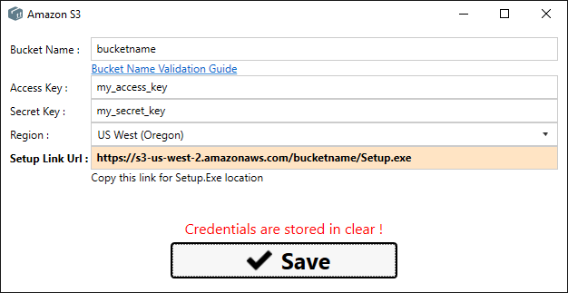

# Package Creation

This is the GUI for Package Creation :

- **DRAG APPLICATION FILES ** in treeview panel

- **APP ID** - This field has to be the same once you started deploying the application

- **VERSION** - You don't need to manually set this field. Is extracted from the AssemblyVersion attribute of EXE file. To auto-increment the application version read [here.](VersionAutoIncrement.html)

- **UPLOAD LOCATION** - At now is possible to upload only to AMAZON S3. Once you selected the upload location, press **Edit Connection** to define access credentials.

___
## UPLOAD CONNECTION DEFINITON

Once you press **Edit Connection** , you can start to insert connection details.

*Read [**this**](http://docs.aws.amazon.com/awscloudtrail/latest/userguide/cloudtrail-s3-bucket-naming-requirements.html) for more information about Amazon Bucket Name Validation.*

- **Setup Link Url** - It's where you can download the Setup.exe of your application.

___

## Publish application

- **Publish Complete Setup** - All the setup files are uploaded , needed at least the first application pubblication.

- **Publish Only Update Files** - With this you can upload just the updated files. **Useful for fast bug fixes.**
